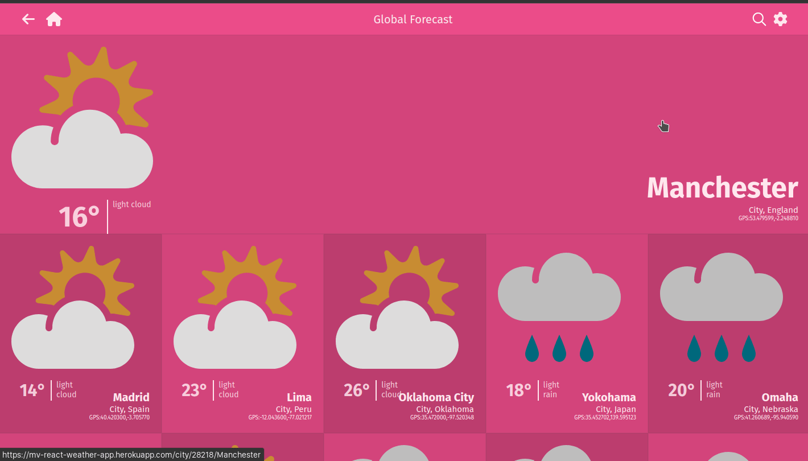

# Weather App

> A Weather app created using React.js and Metaweather API. the app has the functionality to search any city in the world and get the weather data for the week.



## Build with

- [x] React
- [x] Redux
- [x] Thunk
- [x] Redux-Logger
- [x] Vanilla JavaScript
- [x] CSS
- [x] HTML

## Live Demo

[Live Demo Link](https://mv-react-weather-app.herokuapp.com/)

[Video presentation](https://www.loom.com/share/0cfd3b0438ec4d9e84b1c27850e5de1b)

## Getting Started

### Prerequisites

You need to have a browser and this tools installed:

- git
- Node

### Setup

To get a local copy up and running follow these simple example steps:

```
$ git clone git@github.com:Ismailco/weather-app.git

```

```
$ cd weather-app
```

```
$ npm i
```

```
$ npm start
```

### Usage

To build the production version:

```
$ npm run build
```

## Authors

👤 **Ismail Courr**

- GitHub: [@ismailco](https://github.com/ismailco)
- Twitter: [@ismailcourr](https://twitter.com/ismailcourr)
- LinkedIn: [Ismail Courr](https://linkedin.com/in/ismailcourr)

## 🤝 Contributing

Contributions, issues, and feature requests are welcome!

Feel free to check the [issues page](../../issues/).

## Show your support

Give a ⭐️ if you like this project!

## Acknowledgments

- This project is based on the design guidelines creative commons license design. The Original design idea by [Nelson Sakwa on Behance.](https://www.behance.net/sakwadesignstudio)

## 📝 License

This project is [GPL-3.0](./LICENSE) licensed.
